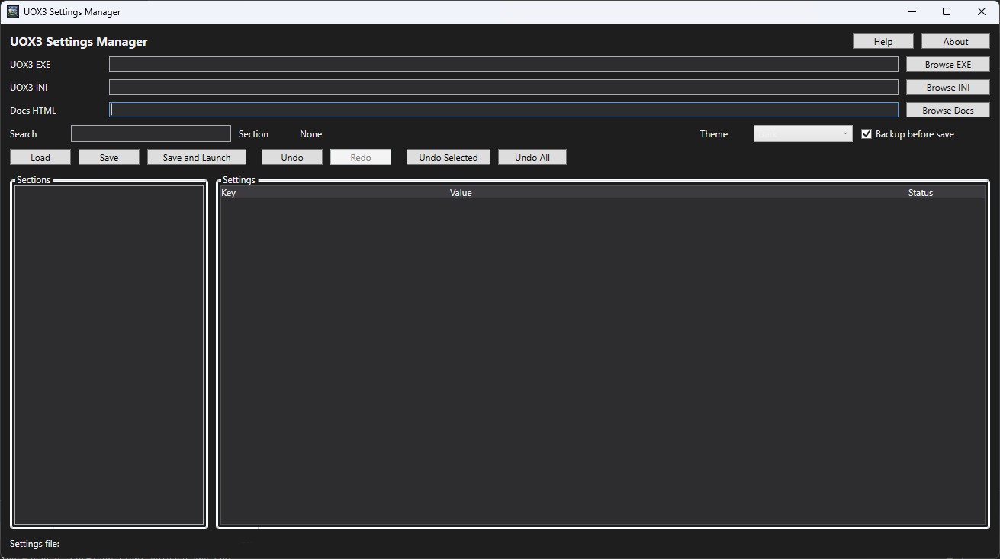

UOX3 Settings Manager

A desktop settings manager for UOX3 servers that simplifies editing INI configuration files with built-in documentation, search, and undo/redo support.

Overview

UOX3 Settings Manager is a Windows-based tool designed to make managing server configuration easier, safer, and more efficient.

Instead of manually editing INI files, this tool provides a structured interface with documentation and validation, helping reduce errors and speed up workflow.

Features
Full INI file parsing and editing
Built-in documentation for settings
Search support for sections and keys
Undo / Redo system for safe editing
Clean and simple UI
Automatic loading and saving of configuration files
Designed specifically for UOX3 server environments
Why This Tool Exists

Editing INI files manually can be:

Error-prone
Time-consuming
Hard to understand without documentation

This tool solves that by:

Showing structured data instead of raw text
Providing inline explanations
Allowing safe changes with undo support
Getting Started
Download
Go to the Releases page:
https://github.com/UO-Moons/UOX3-Settings-Manager/releases
Download the latest zip file
Extract the contents
Run:
UOX3SettingsManager.exe
Usage
Open your UOX3 configuration file
Browse sections and settings
Edit values directly in the UI
Use search to quickly find settings
Save changes when done
Screenshots

(Add your screenshot here once uploaded)

Example:

Project Structure
Models
Handles INI structure and data representation
Services
Parsing, documentation, and settings management
UI (WPF)
Main interface and interaction logic
Roadmap
Dark mode improvements
Validation warnings for incorrect values
Integration with UOX3 documentation files
Profile-based configuration presets
Direct integration with server tools
Contributing

Contributions, suggestions, and feedback are welcome.

If you find issues or have ideas for improvements, feel free to open an issue or submit a pull request.

License

(Add your license here, for example MIT)

Links
UOX3 GitHub
[https://github.com/UOX3DevTeam/UOX3](https://discord.com/channels/487859565254148100/1485359141634572338)
